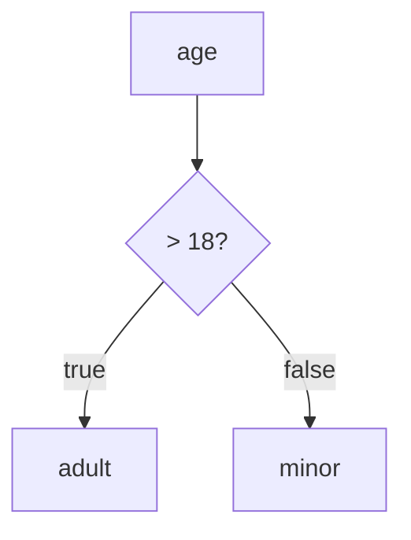

# JSONLogic UI

A modern, interactive web application for building, testing, and visualizing [JSONLogic](https://jsonlogic.com/) rules. Built with Next.js 16, React 19, and a beautiful UI powered by shadcn/ui.


## Features

### 🎨 Rich Code Editor
- **Monaco Editor** - Full-featured code editor with syntax highlighting, auto-completion, and error detection
- **Real-time JSON validation** - Instant feedback on JSON syntax errors
- **JSONLogic validation** - Validates rules against the JSONLogic specification
- **Multi-key support** - Define rules for different keys in a single JSON object

### 🌳 Interactive Tree Visualization
- **Hierarchical tree view** - See your JSONLogic rules as an expandable/collapsible tree structure
- **Color-coded nodes** - Operators, variables, and values are visually distinct
- **Node highlighting** - Click on any node to see its evaluation path
- **Zoom & pan** - Navigate complex rule trees with ease
- **Step-by-step evaluation** - Watch how your rules are evaluated in real-time with animated data flow

### 🔀 Mermaid Diagram Export
- **Flowchart generation** - Convert JSONLogic rules to Mermaid flowchart syntax
- **Decision tree diagrams** - Visualize `if/then/else` logic as decision trees
- **Copy to clipboard** - One-click export for use in documentation
- **Live preview** - See the Mermaid diagram rendered in real-time
- **Customizable styles** - Choose between different diagram themes and orientations

### 🎲 Smart Test Data Generator
- **Constraint-based generation** - Automatically generate test data that satisfies rule constraints
- **Variable inference** - Detects variables used in rules and their expected types
- **Boundary testing** - Generates edge cases (e.g., for `> 18`, generates 17, 18, 19)
- **Random variations** - Create multiple test scenarios with randomized valid data
- **Type-aware generation** - Supports numbers, strings, booleans, arrays, and nested objects

### 📚 Example Library
- **Pre-built examples** - Explore common JSONLogic patterns and use cases
- **Random rule generation** - Generate random valid JSONLogic rules for learning
- **Category-based examples** - Examples organized by use case:
  - Comparisons & Logic
  - Array Operations
  - String Manipulation
  - Date/Time Logic
  - Business Rules
  - Form Validation

### 🧭 Guided Rule Builder
- **Visual rule builder** - Build rules without writing JSON directly
- **Drag-and-drop** - Compose rules by dragging operators and values
- **Operator reference** - Built-in documentation for all JSONLogic operators
- **Template library** - Start from common patterns and customize
- **Real-time sync** - Changes in builder instantly reflect in JSON editor

## Tech Stack

- **Framework**: [Next.js 16](https://nextjs.org/) with App Router
- **Language**: [TypeScript 5](https://www.typescriptlang.org/)
- **Styling**: [Tailwind CSS 4](https://tailwindcss.com/)
- **UI Components**: [shadcn/ui](https://ui.shadcn.com/)
- **Icons**: [Lucide React](https://lucide.dev/)
- **Code Editor**: [Monaco Editor](https://microsoft.github.io/monaco-editor/)
- **Logic Engine**: [json-logic-js](https://github.com/jwadhams/json-logic-js)
- **Diagrams**: [Mermaid](https://mermaid.js.org/) for flowchart generation

## Getting Started

### Prerequisites

- Node.js 18.17 or later
- npm, yarn, pnpm, or bun

### Installation

1. Clone the repository:
```bash
git clone https://github.com/yourusername/jsonlogicui.git
cd jsonlogicui
```

2. Install dependencies:
```bash
npm install
```

3. Run the development server:
```bash
npm run dev
```

4. Open [http://localhost:3000](http://localhost:3000) in your browser.

## Usage

### Basic Example

Write a JSONLogic rule in the editor:
```json
{
  "if": [
    { ">": [{ "var": "age" }, 18] },
    "adult",
    "minor"
  ]
}
```

Provide test data:
```json
{
  "age": 25
}
```

See the result: `"adult"`

### Multi-Key Rules

Define multiple rules for different outputs:
```json
{
  "isAdult": { ">": [{ "var": "age" }, 18] },
  "canDrive": { ">=": [{ "var": "age" }, 16] },
  "canVote": { ">=": [{ "var": "age" }, 18] }
}
```

### Tree Visualization

The rule above renders as an interactive tree:
```
📦 Root
├── 🔑 isAdult
│   └── ⚡ > (greater than)
│       ├── 📌 var: "age"
│       └── 🔢 18
├── 🔑 canDrive
│   └── ⚡ >= (greater or equal)
│       ├── 📌 var: "age"
│       └── 🔢 16
└── 🔑 canVote
    └── ⚡ >= (greater or equal)
        ├── 📌 var: "age"
        └── 🔢 18
```

### Mermaid Export

Convert rules to Mermaid flowcharts for documentation:


Generated Mermaid code:
```
flowchart TD
    A[age] --> B{"> 18?"}
    B -->|true| C["adult"]
    B -->|false| D["minor"]
```

### Smart Test Data Generation

For the rule `{ ">": [{ "var": "age" }, 18] }`, the generator produces:

| Scenario | Generated Data | Expected Result |
|----------|---------------|-----------------|
| Below threshold | `{ "age": 17 }` | `false` |
| At boundary | `{ "age": 18 }` | `false` |
| Above threshold | `{ "age": 19 }` | `true` |
| Random valid | `{ "age": 42 }` | `true` |

### Supported Operators

| Category | Operators |
|----------|-----------|
| **Logic** | `if`, `==`, `===`, `!=`, `!==`, `!`, `!!`, `or`, `and` |
| **Numeric** | `>`, `>=`, `<`, `<=`, `max`, `min`, `+`, `-`, `*`, `/`, `%` |
| **Array** | `map`, `filter`, `reduce`, `all`, `some`, `none`, `merge`, `in` |
| **String** | `cat`, `substr`, `in` |
| **Data** | `var`, `missing`, `missing_some` |
| **Misc** | `log` |

## Project Structure

```
jsonlogicui/
├── src/
│   ├── app/                    # Next.js App Router pages
│   │   ├── page.tsx           # Main application page
│   │   ├── layout.tsx         # Root layout
│   │   └── globals.css        # Global styles
│   ├── components/
│   │   ├── ui/                # shadcn/ui components
│   │   ├── editor/            # Monaco editor wrapper
│   │   │   └── JsonEditor.tsx # Monaco-based JSON editor
│   │   ├── tree/              # Tree visualization
│   │   │   ├── RuleTree.tsx   # Interactive tree component
│   │   │   ├── TreeNode.tsx   # Individual tree node
│   │   │   └── TreeControls.tsx # Zoom, pan, expand/collapse
│   │   ├── mermaid/           # Mermaid diagram components
│   │   │   ├── MermaidPreview.tsx  # Live diagram preview
│   │   │   ├── MermaidExport.tsx   # Export controls
│   │   │   └── converter.ts   # JSONLogic to Mermaid converter
│   │   ├── generator/         # Test data generation
│   │   │   ├── DataGenerator.tsx   # Generator UI
│   │   │   ├── ConstraintParser.ts # Extract constraints from rules
│   │   │   └── ValueGenerator.ts   # Generate values by type
│   │   ├── examples/          # Example library
│   │   │   ├── ExamplePicker.tsx   # Example selection UI
│   │   │   └── categories/    # Categorized examples
│   │   └── builder/           # Guided rule builder
│   │       ├── RuleBuilder.tsx     # Visual builder UI
│   │       └── OperatorPalette.tsx # Drag-and-drop operators
│   ├── lib/
│   │   ├── utils.ts           # Utility functions
│   │   ├── jsonlogic/         # JSONLogic helpers
│   │   │   ├── validator.ts   # Rule validation
│   │   │   ├── evaluator.ts   # Rule evaluation with tracing
│   │   │   └── analyzer.ts    # Extract variables & constraints
│   │   └── examples/          # Example rule definitions
│   │       ├── comparisons.ts
│   │       ├── arrays.ts
│   │       ├── strings.ts
│   │       └── business.ts
│   └── types/                 # TypeScript type definitions
│       ├── jsonlogic.ts       # JSONLogic types
│       └── tree.ts            # Tree visualization types
├── public/                    # Static assets
├── package.json
├── tsconfig.json
├── tailwind.config.ts
└── README.md
```

## Scripts

| Command | Description |
|---------|-------------|
| `npm run dev` | Start development server |
| `npm run build` | Build for production |
| `npm run start` | Start production server |
| `npm run lint` | Run ESLint |

## Contributing

Contributions are welcome! Please feel free to submit a Pull Request.

1. Fork the repository
2. Create your feature branch (`git checkout -b feature/amazing-feature`)
3. Commit your changes (`git commit -m 'Add some amazing feature'`)
4. Push to the branch (`git push origin feature/amazing-feature`)
5. Open a Pull Request

## Resources

- [JSONLogic Specification](https://jsonlogic.com/)
- [JSONLogic Playground](https://jsonlogic.com/play.html)
- [json-logic-js Documentation](https://github.com/jwadhams/json-logic-js)

## License

This project is licensed under the MIT License - see the [LICENSE](LICENSE) file for details.

## Acknowledgments

- [JSONLogic](https://jsonlogic.com/) by Jeremy Wadhams
- [shadcn/ui](https://ui.shadcn.com/) for the beautiful component library
- [Vercel](https://vercel.com/) for Next.js and hosting
